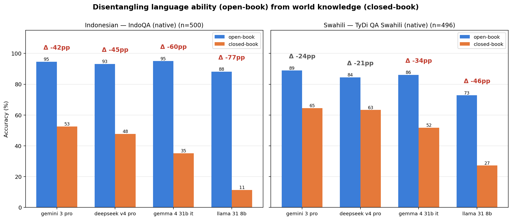
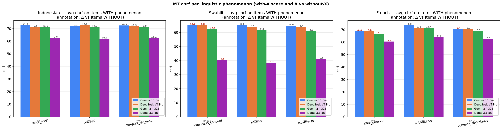

# Fine-Grained Multilingual Evaluation: Detailed Analysis Report

This document contains the complete experimental findings, data slices, and structural analysis from the Question Answering (QA) and Machine Translation (MT) pilots. 

---

## 1. Question Answering (QA) Deep Dive

### 1.1 Disentangling Language Competence from World Knowledge
By comparing Open-Book (context provided) and Closed-Book (no context) conditions, we separate a model's raw reading comprehension ability from its internal knowledge base encoded in that language. 

| Model | IndoQA open → closed | TyDi QA Swahili open → closed |
| :--- | :--- | :--- |
| **Gemini 3.1 Pro** | 94.6% → 52.6% (**Δ −42 pp**) | 89.6% → 64.0% (**Δ −26 pp**) |
| **DeepSeek V4 Pro** | 93.2% → 47.8% (**Δ −45 pp**) | 83.8% → 62.8% (**Δ −21 pp**) |
| **Gemma 4 31B** | 95.0% → 35.2% (**Δ −60 pp**) | 85.4% → 51.4% (**Δ −34 pp**) |
| **Llama 3.1 8B** | 88.2% → 11.4% (**Δ −77 pp**) | 72.2% → 27.0% (**Δ −45 pp**) |

> **Key Insight:** All models read both languages competently when given text (72–95% accuracy). However, the devastating drop-off in closed-book mode proves that aggregate scores on knowledge-heavy benchmarks mask a severe lack of internal knowledge for mid-to-low resource tiers.

### 1.2 The Inference Gap: Literal Matching vs. Logical Reasoning
When open-book performance is sliced by paraphrase distance, a hidden "inference gap" emerges. Models effortlessly resolve surface text-matching but collapse when the answer requires multi-step deduction, fact combination, or counting.

| Language | Literal-Match Items | Items Requiring Inference | Performance Delta ($\Delta$) |
| :--- | :--- | :--- | :--- |
| **Indonesian (IndoQA)** | 93–98% | 38–50% | **-43 to -60 pp** |
| **Swahili (TyDi)** | 82–98% | 27–55% | **-27 to -60 pp** |

### 1.3 Domain Erasure: How Translated Benchmarks Vacuum Cultural Context
Using translated benchmarks (e.g., SQuAD translated from English) creates a severe historical and geographic bias. Translation standardizes world knowledge and strips out native-community nuances.

| Metric | Native Local Content | Translated Local Content | Spatial Delta ($\Delta$) |
| :--- | :---: | :---: | :---: |
| **Indonesian** (*IndoQA → SQuAD-ID*) | 47.8% (history + geo) | **0.8%** | **-47 pp** |
| **Swahili** (*TyDi → SQuAD-SW*) | 34.4% (EA history + geo) | 13.7% | **-21 pp** |

This erasure directly induces a **closed-book accuracy collapse** for smaller models on translated data, purely because they are asked about Western/general world knowledge they never encoded in that target language:

| Model | TyDi-SW Closed (Local Content) | SQuAD-SW Closed (General Content) | Performance Delta ($\Delta$) |
| :--- | :---: | :---: | :---: |
| **Gemini 3.1 Pro** | 64.0% | 52.8% | -11 pp |
| **DeepSeek V4 Pro** | 62.8% | 42.8% | -20 pp |
| **Gemma 4 31B** | 51.4% | 30.7% | -21 pp |
| **Llama 3.1 8B** | **27.0%** | **8.6%** | **-18 pp** |

---

## 2. Machine Translation (MT) Deep Dive

### 2.1 System-Level Resource Tier Breakdown
When evaluating English to Target translation, macro-averages hide massive resource-tier drops for smaller open weights. Frontier models maintain a tight capability band, while small models drop below functional utility on low-resource targets.

| Tier | Language | Gemini 3.1 Pro (chrF) | Gemma 4 (chrF) | Llama 3.1 8B (chrF) | Llama Gap to Top |
| :--- | :--- | :---: | :---: | :---: | :---: |
| **High** | French | 72.75 | 70.88 | 64.58 | -8.17 |
| **Mid** | Indonesian | 72.17 | 70.88 | 61.73 | -10.44 |
| **Low** | Swahili | **65.46** | **62.87** | **40.75** | **-24.71** |

*Note: At chrF 40.75, Llama 3.1 8B scores an LLM-judge adequacy of 1.56/5, rendering output effectively unintelligible.*

### 2.2 Phenomenon-Specific Quality Degradation
Slicing performance by isolating specific linguistic features demonstrates that **every language possesses its own structural bottleneck**. 

The table below shows the isolated chrF metric delta (**with phenomenon** minus **without phenomenon**) across all models:

| Language Focus | Tagged Phenomenon | Gemini Pro | DeepSeek | Gemma 4 | Llama 8B | Diagnostic Verdict |
| :--- | :--- | :---: | :---: | :---: | :---: | :--- |
| **Swahili** | `noun_class_concord` | **-13.24** | -6.78 | **-13.28** | -9.52 | Critical structural failure for all tiers |
| | `passive` | -0.39 | -2.42 | -2.39 | -4.29 | Moderate impact; small models struggle |
| | `locative_ni` | -0.99 | -2.35 | -2.91 | +0.80 | Negligible to small impact |
| **French** | `clitic_pronoun` | **-5.97** | -5.05 | **-6.13** | **-6.12** | Uniformly distributed moderate drop |
| | `complex_NP_relative` | -3.43 | -2.66 | -2.76 | -2.83 | Minor, consistent friction |
| | `subjunctive` | +1.16 | -0.96 | +0.34 | -0.38 | Statistical noise / negligible |
| **Indonesian**| `voice_meN` | +1.35 | -0.52 | +1.07 | +2.82 | Well handled across all tiers |
| | `voice_di` | +0.08 | +2.59 | +0.87 | +0.39 | Well handled across all tiers |
| | `complex_NP_yang` | +0.88 | +0.90 | +0.90 | +1.37 | Well handled across all tiers |

> **The Noun Class Concord Bottleneck:** Rich, agglutinative Bantu agreement morphology dramatically breaks translation coherence. Gemini Pro drops from 78.4 to 65.2 chrF when concord features are present. This proves that structural grammatical complexity challenges LLMs uniformly, scaling regardless of parameter size or frontier capability.

---

## 3. Cross-Task Asymmetry

Linguistic complexity is not a universal constant. It is deeply tied to the task framework. The table below contrasts the most disruptive linguistic features isolated in QA vs. MT for identical languages:

| Language | Hardest Feature in QA (Reading) | Hardest Feature in MT (Generation) |
| :--- | :--- | :--- |
| **Swahili** | **Passive voice constructions** (-26 to -38pp accuracy drop) | **Noun class concord** (-7 to -13 chrF point drop) |
| **Indonesian** | Baseline case: no feature exceeds ±5pp drop across all four models | Baseline case: no feature exceeds ±3 chrF drop across all four models |

### Note on the Indonesian Baseline
The flatness of Indonesian's per-phenomenon profile across both tasks is not an absence of finding but a methodological essential. If all three tested languages exhibited phenomenon-specific drops, the diagnostic could not distinguish language-specific bottlenecks from methodological artifacts. Indonesian's profile shows that voice prefixes (meN-, di-), reduplication, and yang-relative-clauses are well-learned by current LLMs at the mid-resource tier. This validates that the bottlenecks identified for Swahili (Bantu agreement morphology) and French (Romance pre-verbal clitics, see Section 2.2) are genuinely language-specific properties, not universal artifacts of LLM evaluation.

### Methodological Concomitant
Because the exact same tagging rules and text segments yield entirely distinct failure bottlenecks across tasks, **linguistic difficulty cannot be indexed into a single universal taxonomy**. Diagnostic frameworks must be customized explicitly for individual `(language, task)` pairs.

---

## 4. Limitations & Confound Controls

* **Sample Size Constraints:** Slices tracking rare phenomena (e.g., Indonesian reduplication, Swahili applicative syntax) suffer from high variance due to small bucket counts ($\ge 50$ items minimum per bucket, but often noisy).
* **Automated Tagging Integrity:** Linguistic feature annotation relies completely on Claude 4.6 Sonnet. While highly precise on structural morphology (`noun_class_concord`), it exhibits systematic under-tagging or omission on highly nuanced structures (e.g., registering 0% applicative constructions in TyDi datasets).
* **Evaluating the Evaluation Pipeline:** Using Gemini 3 Flash as a unified translation engine for generating QA cross-benchmarks controls for pipeline configuration biases. However, this means conclusions regarding translated benchmarks generalize cleanly over *Gemini-class* engines, containing localized artifacts of that specific model tier.
* **Directional Blind Spot:** Translation evaluation operates purely in the English $\rightarrow$ Target direction. Inverse translation targets (Target $\rightarrow$ English) remain unmonitored and likely demonstrate highly divergent failure modes.