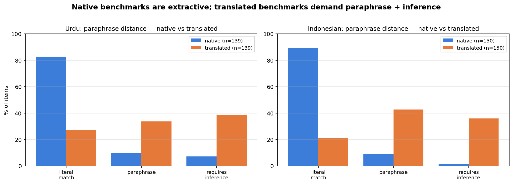

# Multilingual Evaluation Pilot — Native vs Translated Benchmarks Across Two Typologically Distant Languages

> Pilot study examining how multilingual benchmark performance is shaped by (a) whether the benchmark is natively created or translated, and (b) whether models are evaluated with or without supporting context. Three models tested on extractive QA and MCQ in **Urdu** (Indo-Aryan, SOV, rich morphology, Perso-Arabic script) and **Indonesian** (Austronesian, SVO, light morphology, Latin script), with linguistic-phenomenon tagging. **Result: aggregate accuracy systematically conflates language ability with world knowledge, in directions that vary by language and which a diagnostic method makes visible.**

Conducted as preparation for the PhD application *"Task-Specific and Linguistically Motivated Evaluation for Multilingual NLP"* at Inria ALMAnaCH (Bawden, Sagot).

---

## Motivation

Current multilingual benchmarks report a single accuracy number, but that number conflates multiple distinct capabilities: linguistic competence, world knowledge stored in the model, susceptibility to artifacts of benchmark construction. As the framing of the [Inria ALMAnaCH PhD call](https://jobs.inria.fr/public/classic/fr/offres/2026-09982) notes, this conflation has led to misleading conclusions about high- vs. low-resource performance gaps. This pilot demonstrates a diagnostic methodology that systematically separates these confounds.

## Setup

**Languages:** Urdu and Indonesian — typologically distant on every axis (family, word order, morphology, script, resource level).

**Datasets:**

| Language | Native (extractive QA) | Translated (MCQ) |
|---|---|---|
| Urdu | UQuAD, n=139 | Belebele `urd_Arab`, n=139 |
| Indonesian | IndoQA validation, n=150 | Belebele `ind_Latn`, n=150 |

**Models (via OpenRouter):**
- `anthropic/claude-opus-4.7` — frontier
- `qwen/qwen-2.5-7b-instruct` — multilingual-tuned mid
- `meta-llama/llama-3.1-8b-instruct` — weak baseline

**Conditions:**
- **Open-book** (passage given) — tests language understanding
- **Closed-book** (no passage) — tests world knowledge encoded in the model
- **MCQ** (Belebele only) — translated benchmark structure

**Tagger:** `deepseek/deepseek-v4-pro` auto-tagged each item with:
- **Language-specific morphosyntactic phenomena** — Urdu: ergative *ne*, *izafat*, light verbs, complex NPs (relative or participial); Indonesian: voice-*meN*, voice-*di*, reduplication, *yang*-clauses
- **Paraphrase distance** — `literal_match` / `paraphrase` / `requires_inference`
- **Domain** — language-conditioned local-specific vs general

**Judge:** `openai/gpt-4o-mini` binary correct/incorrect for extractive QA; exact-match for MCQ.

## Key findings

### 1. Open- vs. closed-book contrast cleanly disentangles language ability from world knowledge


| Model | Urdu open → closed | Indonesian open → closed |
|---|---|---|
| Claude Opus 4.7 | 91 → 79 (**Δ −12 pp**) | 96 → 47 (**Δ −49 pp**) |
| Qwen-2.5-7B | 86 → 25 (Δ −61 pp) | 89 → 17 (Δ −71 pp) |
| Llama-3.1-8B | 86 → 29 (Δ −57 pp) | 89 → 13 (Δ −76 pp) |

Small models read both languages reasonably well (open-book 86–89 %) but lack the world knowledge to answer without context (drop 57–76 pp). More strikingly, **Claude — a frontier model — drops 49 pp on Indonesian closed-book despite scoring 96 % open-book**. This is direct evidence that aggregate accuracy on knowledge-heavy closed-book benchmarks (e.g., MMLU-translated) is mostly measuring world knowledge encoded in the language, not language competence. For low- and mid-resource languages, this conflation drives misleading conclusions about model "language ability."

### 2. Native and translated benchmarks measure different things



Native benchmarks (UQuAD, IndoQA) are dominantly extractive: 83 % / 89 % `literal_match`. Translated Belebele flips this in both languages: 27 % / 21 % `literal_match`, with the rest requiring paraphrase or inference. A native and a translated benchmark in the *same language* therefore test substantially different capabilities — comparing scores across them is not apples-to-apples.

### 3. Translation artifacts vary by language — sometimes in opposite directions

| Distinctive marker | Urdu native → translated | Indonesian native → translated |
|---|---|---|
| Language-specific morphosyntax | *izafat* 13 % → **5 %** (under-represented) | *yang*-clause 31 % → **47 %** (over-represented) |

For Urdu, translation **strips out** the Persian-origin *izafat* construction. For Indonesian, translation **increases** the rate of *yang*-relative-clauses because translationese tends toward more syntactically complex sentences. Same diagnostic, opposite artifact directions. The takeaway: aggregate accuracy cannot anticipate which way the benchmark will skew — diagnostic methods are needed precisely because the direction is language-specific and not predictable from typology alone.

### 4. Coarse phenomenon tagging conflates linguistic complexity with task scaffolding

Items with relative clauses (`complex_NP`) showed *higher* open-book accuracy on UQuAD, counter to expectation. Inspection revealed that the relative clause often pins down the answer span — e.g., *"the prisoners who stayed in the yard after the fight"* literally identifies where to look in the passage. The `complex_NP` tag therefore conflates *linguistic complexity* (which should hurt accuracy) with *task-completion scaffolding* (which helps). Similarly, the Indonesian `voice_meN` tag captures both productive active-voice morphology (*membaca*) and lexicalised frozen forms (*menjadi*) which native speakers no longer analyse as morphologically complex. **A finer-grained diagnostic needs to distinguish productive from lexicalised morphology, and difficulty-signalling from scaffolding-providing structures** — this is one of the directions a thesis extension would address.

### 5. Failure modes differ by model architecture (qualitative)

On closed-book UQuAD items where the small models fail, the failure pattern is systematic and architecture-bound:

- **Qwen-2.5-7B** (Chinese-origin model) — code-switches to Mandarin when uncertain, generating partial Chinese hallucinations
- **Llama-3.1-8B** (English-origin) — produces script-mixed token salad (e.g., `ابن मलजमібн ملجم الأسدی asympt reinforcement`)
- **Claude Opus 4.7** — stays coherent in Urdu but may hallucinate factual content

Aggregate accuracy treats every wrong answer as equivalent. The diagnostic perspective is that the *failure mode itself* is a meaningful result — and it depends on the model's pretraining bias, not just its overall capability.

## What this pilot says about the broader methodology

1. **Open- / closed-book contrast** is a cheap, effective primitive for separating language ability from world knowledge. It should be standard practice for any extractive-answerable benchmark.
2. **Coverage reports** — the linguistic-phenomenon distribution of a benchmark — should precede or accompany score reports. *What* a benchmark tests is more important than how well models happen to score on it.
3. **Diagnostic tagging must distinguish linguistic complexity from task scaffolding**; surface-form tagging is a starting point, not an endpoint.
4. **Direction of native-vs-translated artifact is language-specific** and cannot be predicted *a priori*. Diagnostic methods are needed for every (language, benchmark) pair.

## Limitations

- Small sample sizes (139 / 150 native items per language). Effect sizes for rare phenomena (e.g., Indonesian reduplication, n=7) are noisy.
- Auto-tagger is LLM-based (DeepSeek V4 Pro). Indonesian tags were native-speaker spot-checked; Urdu tags validated against regex sanity checks on the discrete markers.
- Translated Belebele uses MCQ format while native QA is extractive — accuracy comparison has format confound. Coverage analysis is format-independent.
- Single judge model (GPT-4o-mini) for extractive QA. No held-out human-verification subset.

## Future directions (for thesis extension)

These map directly onto the three axes of the Inria ALMAnaCH PhD call:

- **Productive vs. lexicalised morphology** — distinguish e.g. productive *meN-* on a transitive verb from lexicalised *menjadi*; productive Urdu light-verbs from fossilised compounds
- **Language-specific challenge sets** synthesised to fill under-covered phenomena, in the spirit of Zebaze et al. (2025)
- **Cross-language diagnostic comparability** — which axes generalise across typologically distant languages, which are language-specific
- **Failure-mode taxonomy** — systematic categorisation of *how* models fail (code-switching, script-salad, hallucination), not only *whether*

## Reproduce

```bash
pip install -r requirements.txt
echo "OPENROUTER_API_KEY=sk-or-..." > .env
python run_pipeline.py            # prepare → tag → infer → judge
python analyze.py                  # coverage report + accuracy table + charts
```

Single source of truth: [`data/results.jsonl`](data/results.jsonl) — one record per item with all tags, predictions, verdicts. Charts in [`outputs/`](outputs/). Smoke test: `python run_pipeline.py --limit 5`. Estimated cost: ~$25–35 USD via OpenRouter.

## File layout

```
.
├── run_pipeline.py            prepare + tag + infer + judge (single command)
├── analyze.py                 coverage report + accuracy table + charts
├── requirements.txt
├── data/
│   └── results.jsonl          one record per item — all stages combined
├── outputs/
│   ├── 00_combined_disentanglement.png        ← headline chart
│   ├── 00_combined_paraphrase_distance.png    ← native vs translated structure
│   ├── ur/  (coverage + accuracy + sliced for Urdu)
│   └── id/  (same for Indonesian)
└── README.md  ← this file
```
